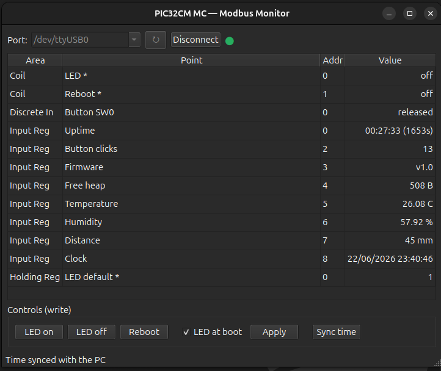

# PIC32CM MC00 Modbus RTU (Zephyr)

A Modbus RTU running on the PIC32CM MC00 Curiosity Nano (PIC32CM1216MC00032) with Zephyr RTOS v4.4.1.

This project accompanies the article "Quanto cabe em 16 KB de RAM?" and demonstrates how a practical Zephyr application can run on a Cortex-M0+ microcontroller with only 128 KB of Flash and 16 KB of RAM.

The demo includes Modbus RTU communication, I²C sensor support, and NVS-based configuration persistence.


## Pin map

| Pin | Function | Peripheral |
|-----|----------|------------|
| PA00 | UART TX | Console shell |
| PA01 | UART RX | Console shell |
| PA08 | I²C SDA | SHT3x, VL53L0X, SSD1306, MCP23008 |
| PA09 | I²C SCL | SHT3x, VL53L0X, SSD1306, MCP23008 |
| PA14 | UART TX | Modbus RS-485 |
| PA15 | UART RX | Modbus RS-485 |
| PA10 | GPIO (output) | RS-485 DE/RE |
| PA02 | GPIO (output) | IHM shield RESET |
| PA03 | GPIO (input) | MCP23008 INT |
| PA22 | GPIO (input) | SW0 button |
| PA23 | GPIO (output) | Board LED0 |

## Build / flash

Built against an external Zephyr install at `$HOME/zephyrproject` (no `west init`
needed here):

```bash
$ export PATH=$HOME/zephyrproject/.venv/bin:$PATH
$ pyocd pack install pic32cm1216mc00032
$ APP=$PWD/app
$ cd $HOME/zephyrproject
$ west build -b pic32cm1216mc -p always -s "$APP" -d "$APP/build"
$ west flash -d "$APP/build"
```

Memory footprint of the full app, note how tight the **16 KB RAM** budget is:

```
[223/223] Linking C executable zephyr/zephyr.elf
Memory region         Used Size  Region Size  %age Used
           FLASH:      105276 B       128 KB     80.32%
             RAM:       13624 B        16 KB     83.15%
        IDT_LIST:           0 B        32 KB      0.00%
```

## Modbus register map (all addresses 0-based)

| Area | Addr | R/W | Meaning |
|------|------|-----|---------|
| Coil (FC01/05)        | 0 | RW | LED on/off (manual) |
| Coil (FC01/05)        | 1 | RW | Reboot (write 1) |
| Discrete Input (FC02) | 0 | RO | Button SW0 state (1=pressed) |
| Input Reg (FC04)      | 0 | RO | Uptime seconds, high word |
| Input Reg (FC04)      | 1 | RO | Uptime seconds, low word |
| Input Reg (FC04)      | 2 | RO | Button press count |
| Input Reg (FC04)      | 3 | RO | Firmware version (0x0100) |
| Input Reg (FC04)      | 4 | RO | Free heap (bytes) |
| Input Reg (FC04)      | 5 | RO | SHT3x temperature, °C ×100 (signed) |
| Input Reg (FC04)      | 6 | RO | SHT3x humidity, %RH ×100 |
| Input Reg (FC04)      | 7 | RO | VL53L0X distance, mm (clamped to 65535) |
| Input Reg (FC04)      | 8 | RO | RTC time, epoch seconds high word |
| Input Reg (FC04)      | 9 | RO | RTC time, epoch seconds low word |
| Holding Reg (FC03/06) | 0 | RW | LED default state, restored on boot (NVS) |
| Holding Reg (FC03/06) | 1 | RW | Set time, epoch seconds high word (buffered) |
| Holding Reg (FC03/06) | 2 | RW | Set time, epoch seconds low word (applies to RTC) |

Server is unit id 1, 115200 8N1. Test with `mbpoll` (note `-P none`):

```bash
$ mbpoll -m rtu -a 1 -b 115200 -P none -1 -t 3 -r 1 -c 8 /dev/ttyUSB0
```

## Test software (GUI)

A PySide6 Modbus RTU client in [software/](software/) reads, monitors and writes
all the firmware registers through a USB-RS485 adapter.



```bash
$ cd software
$ make gui                      # installs deps in .venv and launches the GUI
$ make gui PORT=/dev/ttyUSB1    # use a different serial port
```

Or run it directly (it bootstraps its own `.venv` on first launch):

```bash
$ cd software
$ ./main.py --port /dev/ttyUSB0
```